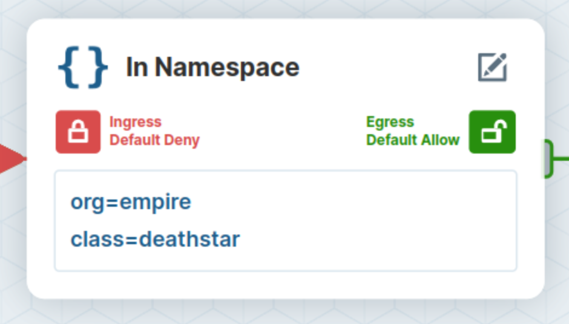
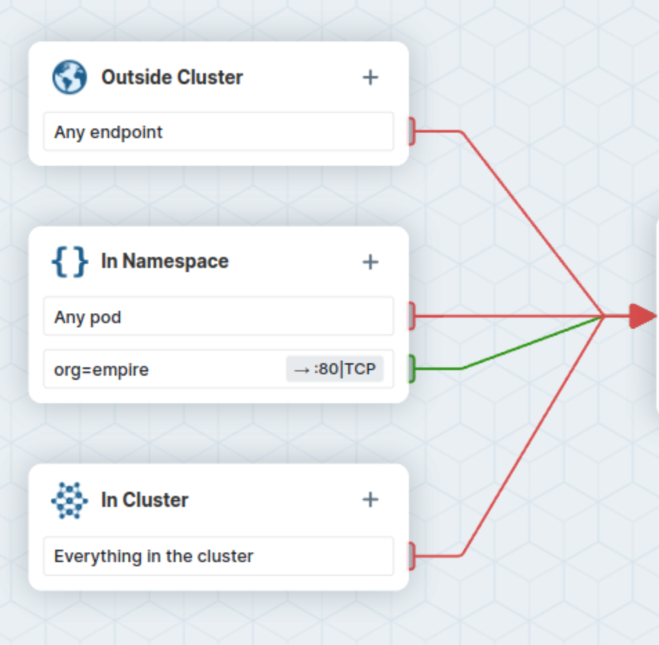
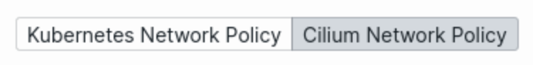

# Lab 3

## Creating a Network Policy

We’ll start with the basic policy to restrict deathstar landing requests to the
ships that have label `org=empire only`.

Before we start changing the policies right away, let's think about what a
corresponding network policy should look like.

We need to match on empire ships only, so we need to match on that label:

```yaml
spec:
  description: "L3-L4 policy to restrict deathstar access to empire ships only"
  endpointSelector:
    matchLabels:
      org: empire
      class: deathstar
```

Furthermore, we have to make sure that ingress from endpoints with the label
`empire` is allowed to port `80` for protocol `tcp`:

```yaml
  ingress:
  - fromEndpoints:
    - matchLabels:
        org: empire
    toPorts:
    - ports:
      - port: "80"
        protocol: TCP
```

## Visualizing a Network Policy

While this example is relatively simple, Kubernetes operators sometimes find it
difficult to understand and to build network policies.

Cilium has a tool for this: [editor.cilium.io][lab3-policy]. Click on it to see
a visual and interactive representation of your policy, and change some values
if you want to better understand what the policy is doing.

[lab3-policy]: https://app.networkpolicy.io/?policy-url=https://raw.githubusercontent.com/cilium/cilium/HEAD/examples/minikube/sw_l3_l4_policy.yaml

The central part of the diagram represents the Network Policy selector:



Each side shows respectively which ingress and egress are allowed for this
workload.

Verify that the current selector (`org=empire`, `class=deathstar`) is only
allowed ingress traffic from pods labeled as `org=empire`:



Check the corresponding Network Policy manifests in the editor below. Note that
they can be viewed either in the standard Kubernetes Network Policy format, or
using the Cilium Network Policy specification, which allows for extra features.



## Enforcing a Network Policy

Once you are done visualizing the policy in the editor, change back to your
terminal. There we can apply a preconfigured network policy with the values
discussed above to our demo system:

```
kubectl apply -f https://raw.githubusercontent.com/cilium/cilium/HEAD/examples/minikube/sw_l3_l4_policy.yaml
```

Now let's try to land the empire tiefighter again (HTTP POST from tiefighter to
deathstar on the /v1/request-landing path):

```
kubectl exec tiefighter -- curl -s -XPOST deathstar.default.svc.cluster.local/v1/request-landing
```

This still works, which is expected.

In comparison, if you try to request landing from the xwing pod, you will see
that the request will eventually time out:

```
kubectl exec xwing -- curl -s -XPOST deathstar.default.svc.cluster.local/v1/request-landing
```

Kill the request with `Ctrl+C` once you realize that it hangs.

We have successfully blocked access to the deathstar from an X-Wing ship. Let's
now see how we could make this policy a bit more fine-grained using L7 rules.
