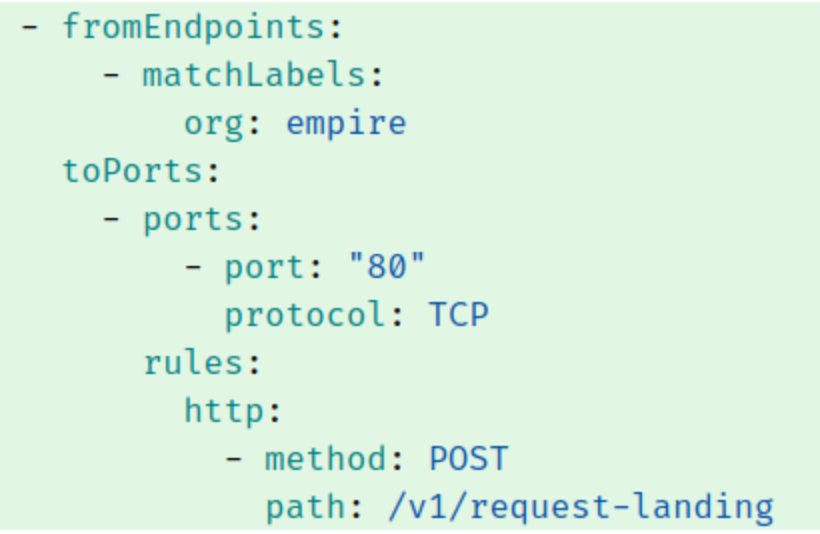

# Lab 4

## Filtering Paths

Consider that the deathstar service exposes some maintenance APIs which should
not be called by random empire ships. To see why those APIs are sensitive, run:

```
kubectl exec tiefighter -- curl -s -XPUT deathstar.default.svc.cluster.local/v1/exhaust-port
```

Yes, there is a `Panic`: the Death Star just exploded!

As you can see, this leads to rather unwanted results. While this is an
illustrative example, unauthorized access such as above can have adverse
security repercussions. We need to enforce policies on the HTTP layer, at layer
7, to limit what exact APIs the tiefighter is allowed to call —and which are
not.

We need to extend the existing policy with an HTTP rule such as:

```yaml
rules:
  http:
  - method: "POST"
    path: "/v1/request-landing"
```

This will restrict API access to only the `/v1/request-landing` path and will
thus prevent users from accessing the `/v1/exhaust-port`, which caused a crash
as we saw earlier.

## Visualizing a Network Policy

Let's have a look at how such an extended policy might look like in the
[editor][lab3-policy].

The new L7 network policy is now loaded, including the HTTP API filter.

Verify in the Kubernetes manifest that this policy will filter access to the
deathstar by path.

[lab3-policy]: https://app.networkpolicy.io/?policy-url=https://raw.githubusercontent.com/cilium/cilium/HEAD/examples/minikube/sw_l3_l4_l7_policy.yaml



## Enforcing the Network Policy

Once you have done so, switch back to your terminal and apply this updated rule
to your demo system:

```
kubectl apply -f https://raw.githubusercontent.com/cilium/cilium/HEAD/examples/minikube/sw_l3_l4_l7_policy.yaml
```

Run the same test as above, and see the different outcome:

```
kubectl exec tiefighter -- curl -s -XPUT deathstar.default.svc.cluster.local/v1/exhaust-port
```

As you can see, with Cilium L7 security policies, we are able to restrict
tiefighter's access only the required API resources on deathstar, thereby
implementing a “least privilege” security approach for communication between
microservices.
